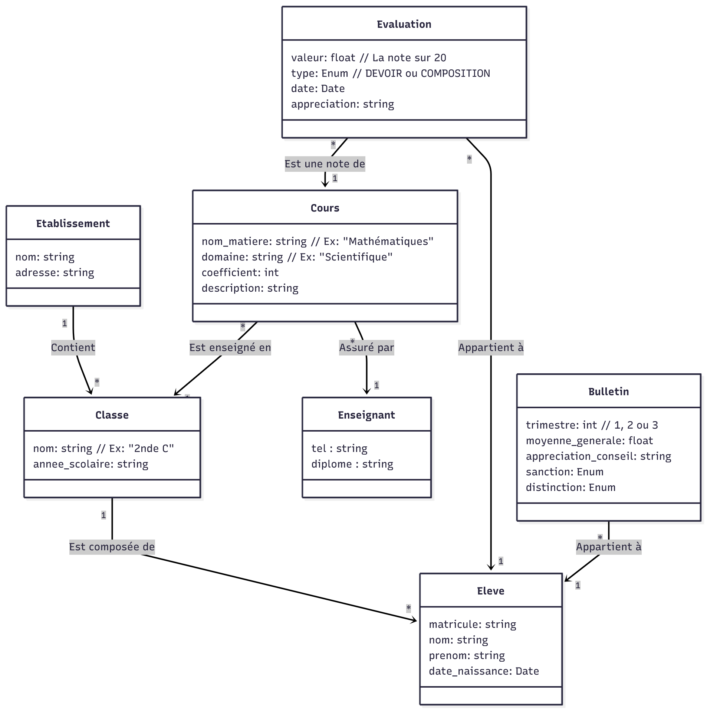

# Système de Gestion Scolaire (School Management System) 🎓

Ce projet est une application JavaScript modélisant un système complet de gestion de notes et de bulletins scolaires. Il a été conçu pour automatiser le processus de notation d'un établissement scolaire (basé sur le modèle du système éducatif tchadien), en mettant l'accent sur une architecture Orientée Objet robuste et modulaire.

## 🚀Fonctionnalités Clés

- Gestion des Acteurs : Administration des élèves et des enseignants via un système d'héritage.

- Architecture Flexible : Utilisation d'une classe d'association pivot (Cours) liant dynamiquement Professeur, Classe et Matière (avec gestion des coefficients variables).

- Système de Notation Complet : \* Distinction entre notes de Devoir et de Composition.

- Calcul automatique des moyennes pondérées.

- Génération de Bulletins : Calcul des moyennes trimestrielles, appréciations automatiques et gestion des sanctions/distinctions.

## 🛠️ Architecture Technique

Le projet est conçu selon les principes modernes de JavaScript (ES6 Modules) et de la POO.

### Structure des Modules

L'application est découpée en 5 modules fonctionnels pour garantir la maintenabilité :

- Personnes.js : Gère les classes humaines (Personne, Eleve, Enseignant).
- Structure.js : Gère l'infrastructure (Etablissement, Classe).
- Pedagogie.js : Le cœur du système. Contient la classe pivot Cours qui lie un enseignant à une classe pour une matière donnée.
- Evaluation.js : Gère la logique de notation (Evaluation, Bulletin) et les calculs de moyennes.
- Main.js : Point d'entrée pour l'exécution des scénarios de test.

### Modélisation UML (Aperçu)

## 💻 Installation et Utilisation

Ce projet est conçu pour fonctionner nativement dans un environnement supportant les modules ES6 (Node.js ou Navigateur moderne).

## 🧠 Concepts Appris & Mis en Œuvre

Ce projet est le fruit d'un apprentissage approfondi de JavaScript. Il met en pratique :

- Classes & Héritage (extends, super) : Pour ne pas répéter le code entre Eleve et Enseignant.

- Encapsulation & Champs Privés (#) : Pour protéger les données sensibles.

- Méthodes Statiques : Pour les utilitaires de comparaison.

- Gestion de la Mémoire : Compréhension des références d'objets (Deep vs Shallow Copy).

- Algorithmique : Logique de filtrage et de réduction pour les calculs de moyennes complexes.

###📝 Auteur
Développé par [Hippolyte DM] dans le cadre d'un parcours d'apprentissage intensif JS.
